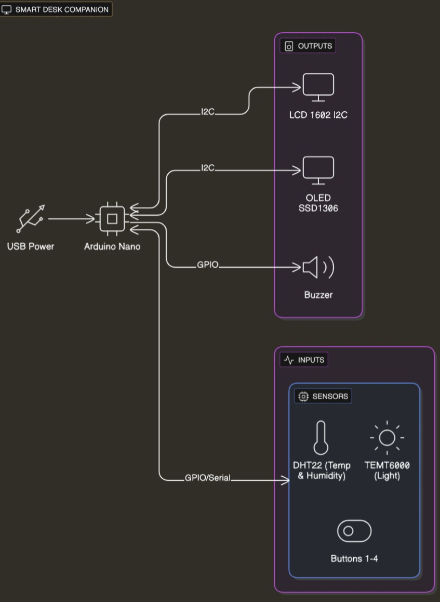
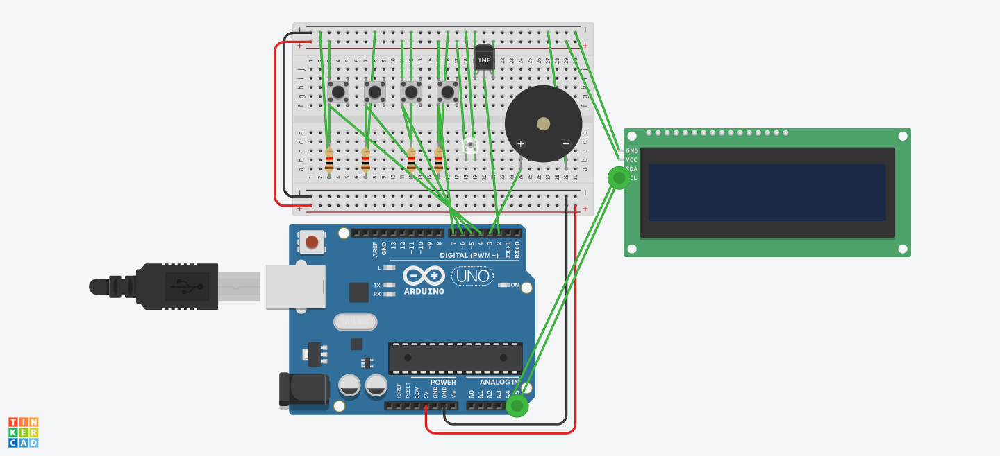

# Smart Desk Companion

**Author**: Lambru Daria-Ana

## Description:
Smart Desk Companion este un dispozitiv multifuncțional de birou care combină tehnologia Pomodoro cu senzori de mediu pentru a optimiza productivitatea și confortul utilizatorului. Include monitorizare a temperaturii, umidității și luminii ambientale, oferind sugestii inteligente și feedback vizual/sonor. Dispozitivul alternează automat sesiuni de lucru și pauză, ține evidența activității zilnice și permite trecerea într-un mod „Relax” cu atmosferă luminoasă calmă. Toate datele sunt trimise prin conexiune serială către laptop pentru vizualizare în timp real sau analiză ulterioară.

## Motivation
Am ales să fac acest proiect pentru că mi s-a părut util și interesant să creez un dispozitiv care să mă ajute să fiu mai productivă atunci când lucrez sau învăț. Am vrut să combin ideea de organizare a timpului (prin metoda Pomodoro) cu senzori care să mă ajute să fiu mai confortabilă la birou – cum ar fi temperatura, umiditatea sau lumina din cameră. 

## Architecture:

### Block diagram

### Schematic

## Components

| Device | Usage | Price |
|--------|-------|-------|
| Arduino Nano + CH340 | Microcontroller | [24,99 RON](https://www.optimusdigital.ro/ro/compatibile-cu-arduino-nano/1686-placa-de-dezvoltare-compatibila-cu-arduino-nano-atmega328p-i-ch340.html) |
| LCD 1602 I2C | Afișaj principal | [14,99 RON](https://www.optimusdigital.ro/ro/optoelectronice-lcd-uri/62-lcd-1602-cu-interfata-i2c-si-backlight-galben-verde.html) |
| OLED 0.96” I2C SSD1306 | Afișaj moduri secundar | [34,05 RON](https://www.emag.ro/afisaj-oled-ssd1306-oled-i2c-compatibil-arduino-si-raspberry-pi-27x27x4-mm-albastru-c9/pd/D3C7C1YBM) |
| Buzzer activ 5V | Feedback sonor | [2,80 RON](https://www.optimusdigital.ro/ro/audio-buzzere/633-buzzer-activ-de-5-v.html) |
| Modul TEMT6000 | Senzor lumină ambientală | [9,98 RON](https://www.emag.ro/modul-senzor-lumina-ambientala-temt6000-compatibil-arduino-ai079-s89/pd/DYK568BBM) |
| Senzor DHT22 | Temperatură & umiditate | [23,12 RON](https://www.optimusdigital.ro/ro/senzori-senzori-de-temperatura/1449-modul-senzor-de-temperatura-i-umiditate-dht22.html) |
| TP229 Capacitive Touch Sensor Module | Modul butoane tactile | [8,67 RON](https://www.optimusdigital.ro/en/touch-sensors/1112-tp229-capacitive-touch-sensor-module.html?search_query=capacitiv&results=95) |
| Breadboard 750 puncte | Prototipare | [8,98 RON](https://www.optimusdigital.ro/ro/prototipare-breadboard-uri/13245-breadboard-750-puncte.html) |
| Fire jumper set | Conexiuni | [7,99 RON](https://www.optimusdigital.ro/ro/fire-fire-mufate/12-set-de-cabluri-pentru-breadboard.html) |
| Cablu USB-Mini | Alimentare & serial | [4,37 RON](https://www.optimusdigital.ro/ro/cabluri-cabluri-usb/3147-cablu-albastru-usb-am-b-mini-30-cm-pentru-arduino-nano.html) |

## Libraries

| **Library** | **Description** | **Usage** |
|-------------|------------------|-----------|
| [DHT sensor library](https://github.com/adafruit/DHT-sensor-library) | Adafruit library for reading DHT temperature & humidity sensors | Read temperature and humidity values |
| [Adafruit Unified Sensor](https://github.com/adafruit/Adafruit_Sensor) | Common sensor interface library used by Adafruit | Interface between sensors and Adafruit sensor libraries |
| [Adafruit SSD1306](https://github.com/adafruit/Adafruit_SSD1306) | OLED display driver for SSD1306-based displays | OLED display control |
| [Adafruit GFX Library](https://github.com/adafruit/Adafruit-GFX-Library) | Core graphics library for Adafruit displays | Used for drawing text and shapes on OLED |
| [LiquidCrystal I2C](https://github.com/johnrickman/LiquidCrystal_I2C) | Library for I2C LCD displays | Controls 16x2 LCD display via I2C |

## Log

### Week 6 - 12 May
- Finalizare comandă și achiziție componente.

### Week 7 - 19 May
- Montare componente hardware pe placă/breadboard.
- Testare senzori DHT22 și TEMT6000 + OLED și LCD.
- Implementare cod de bază pentru afișaje și senzori.
- Inițiere logică Pomodoro (focus/pauză + timer).

### Week 8 - 26 May
- Adăugare animație de repaus.
- Implementare logică completă pentru butoanele 1, 2, 3 și 4.
- Afișaj contextual pe OLED pentru feedback mediu și status ciclu.
- Ajustări finale cod (timp total focus, reset cicluri, buzzer, afișare finală etc.)

